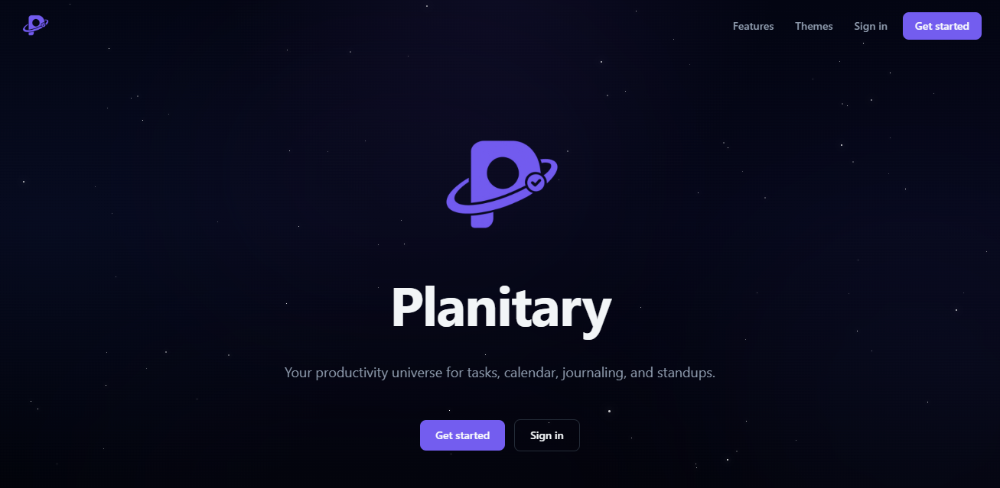
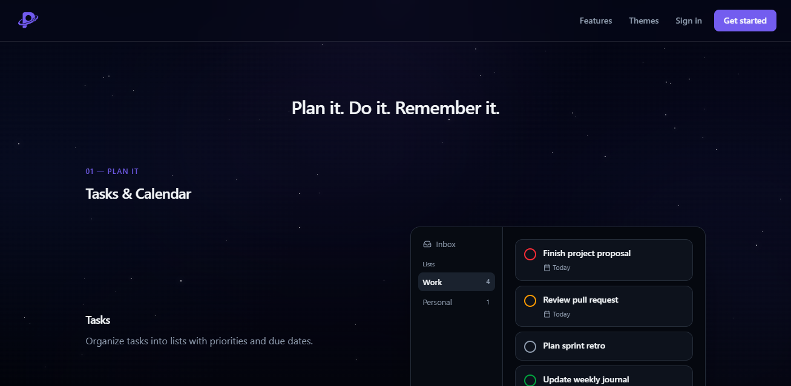
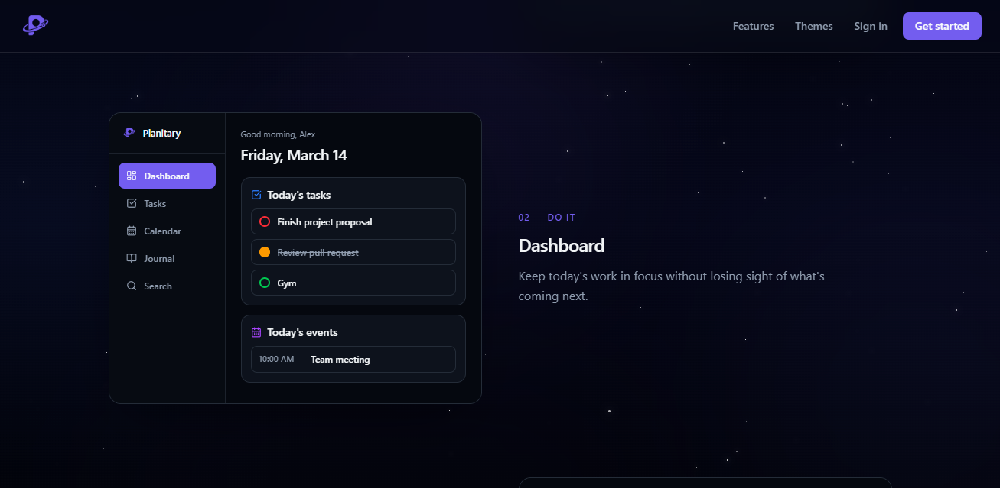
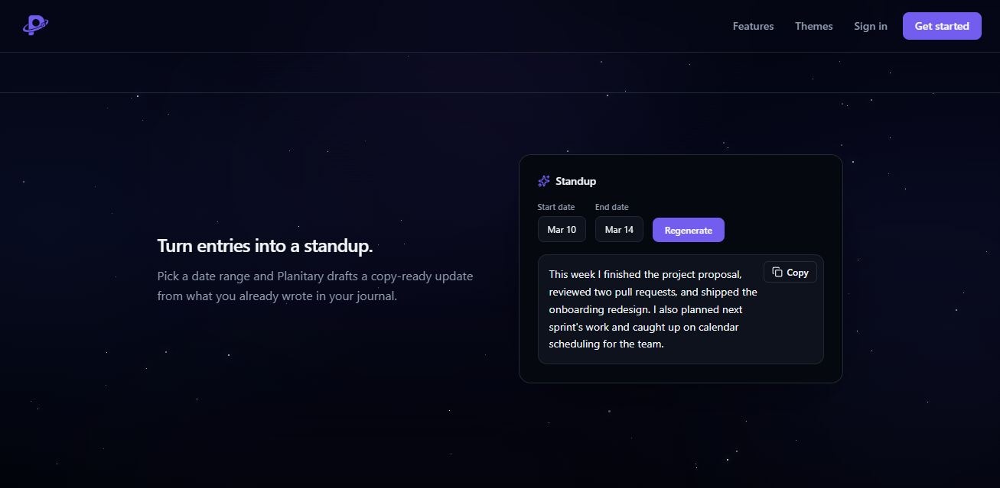
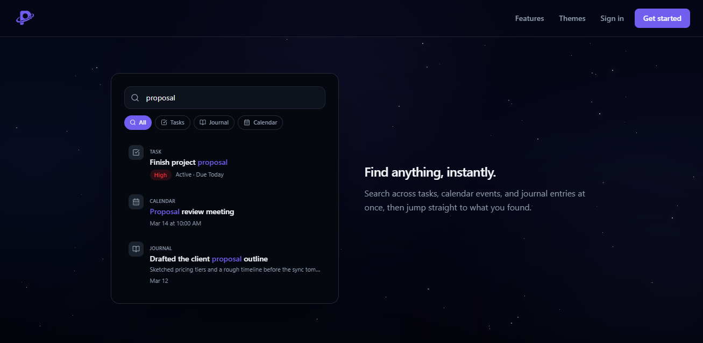

# Planitary

A personal productivity app for tasks, calendar, journaling, and search — with an AI-assisted Journal Standup and unlockable planet appearance themes.

**Live demo:** [https://planitary.app](https://planitary.app)



## Stack

- **Next.js 16** (App Router) · **React 19** · **TypeScript**
- **Tailwind CSS 4**
- **Supabase** (Auth, Postgres, Row Level Security)
- **OpenRouter** (Journal Standup AI)

## Features

- **Tasks & Lists** — priorities, due dates, recurrence, custom drag-and-drop order, and list organization
- **Calendar** — month / week / day views with events alongside due tasks
- **Dashboard** — today’s tasks, events, and journal in one place
- **Journal + Standup** — daily entries, plus AI-generated copy-ready weekly updates
- **Search** — full-text + typo-tolerant search across tasks, calendar, and journal
- **Appearance** — dark/light themes, plus planet themes unlocked by productive days









## Quick start

**Prerequisites:** Node.js 20+, a [Supabase](https://supabase.com) project, and (optional) an [OpenRouter](https://openrouter.ai) API key for Standup.

```bash
npm install
cp .env.example .env.local   # fill in Supabase (+ OpenRouter if using Standup)
npm run dev
```

Then:

1. Apply migrations in `supabase/migrations/` (`0001` … `0012`) via the SQL editor or `supabase db push`.
2. In Supabase → Authentication → URL Configuration, set Site URL and add `/auth/callback` to Redirect URLs (see `.env.example`).
3. Open [http://localhost:3000](http://localhost:3000).

### Scripts

| Command | Purpose |
| --- | --- |
| `npm run dev` | Development server |
| `npm run build` / `npm start` | Production build and serve |
| `npm run lint` | ESLint |
| `npm run typecheck` | TypeScript (`tsc --noEmit`) |
| `npm test` | Unit tests |
| `npm run validate` | lint + typecheck + test + build |

## Docs

- [Feature notes, migrations, and manual checklists](docs/features.md)
- [Environment variables](.env.example)
- [License](LICENSE) (MIT)

## Deploy

The production app is at [planitary.app](https://planitary.app). To deploy your own instance on [Vercel](https://vercel.com) (or any Next.js host):

1. Set env vars from `.env.example`, including `SITE_URL` to your public domain.
2. Configure Supabase Auth Site URL / Redirect URLs for production.
3. Apply migrations to the production Supabase project.
4. Redeploy after changing env vars.
